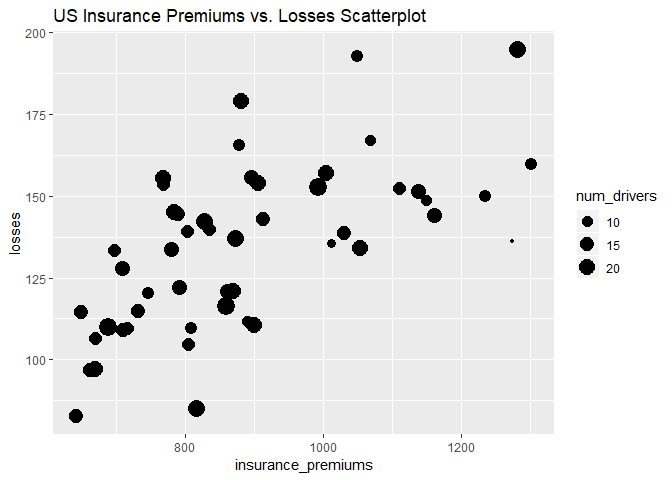
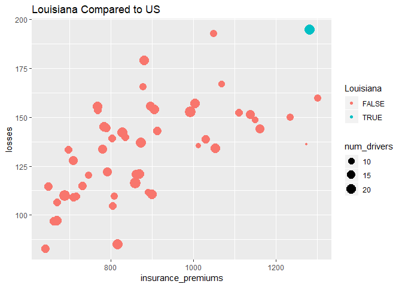
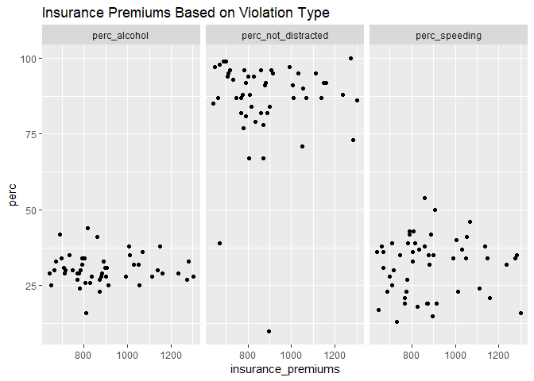

Assignment 3
================

For this assignment we are using a dataset from the website [Fivethirtyeight](http://fivethirtyeight.com/). All these datasets are available on their [GitHub page](https://github.com/fivethirtyeight/data/) and in the `fivethirtyeight` package.

1.  Install and load the `fivethirtyeight` library. For this assigment we are using the dataset `bad_drivers`.

``` r
head(bad_drivers)
```

    ## # A tibble: 6 x 8
    ##   state num_drivers perc_speeding perc_alcohol perc_not_distra~
    ##   <chr>       <dbl>         <int>        <int>            <int>
    ## 1 Alab~        18.8            39           30               96
    ## 2 Alas~        18.1            41           25               90
    ## 3 Ariz~        18.6            35           28               84
    ## 4 Arka~        22.4            18           26               94
    ## 5 Cali~        12              35           28               91
    ## 6 Colo~        13.6            37           28               79
    ## # ... with 3 more variables: perc_no_previous <int>,
    ## #   insurance_premiums <dbl>, losses <dbl>

1.  In the narrative, add a brief description (`?bad_drivers` for a description of the dataset) using *inline code* to show the variable names.

bad\_drivers is a data frame with 51 rows, representing the 50 states and Washington D.C., and 8 variables. The data describes information regarding bad drivers in each of the 50 states. state, num\_drivers, perc\_speeding, perc\_alcohol, perc\_not\_distracted, perc\_no\_previous, insurance\_premiums, losses

1.  Plot a dot chart of premiums by losses. Map the count of drivers to the size of the dots. 

2.  Test what values from `state` are equal to "Louisiana" and assign the output to a new variable called \`Louisiana' (logical)

``` r
Louisiana <- bad_drivers$state == 'Louisiana'
```

1.  Map the variable "Louisiana" to `color`. That way, the dot referring to Louisiana should have a different color. 

2.  In your narrative, use inline code to report the average insurance premium and count of losses in US, and the premium and losses in Louisiana. Do not type those values manually, but extract them from the dataset using inline code.

The average insurance premium is 886.96 The total number of losses incurred in the U.S. is 6859.15 The insurance premium and losses incurred in Louisiana are 1281.55 and 194.78 , respectively.

1.  Report in a tabular format the 5 states with the highest premiums (include only state and insurance\_premiums)

``` r
bdShort <- bad_drivers[,c('state', 'insurance_premiums')] %>%
  arrange(desc(insurance_premiums))
```

    ## Warning: package 'bindrcpp' was built under R version 3.4.4

``` r
bdShort[c(1:5),]
```

    ## # A tibble: 5 x 2
    ##   state                insurance_premiums
    ##   <chr>                             <dbl>
    ## 1 New Jersey                        1302.
    ## 2 Louisiana                         1282.
    ## 3 District of Columbia              1274.
    ## 4 New York                          1234.
    ## 5 Florida                           1160.

1.  Reshape the dataset gathering together perc\_speeding, perc\_alcohol, perc\_not\_distracted in one variable, paired with their pecentages. Name this variable "ViolationType" and the variable for the value pairs "perc".

``` r
bdGather <- gather(bad_drivers, 'ViolationType', 'perc', perc_speeding, perc_alcohol, perc_not_distracted)
```

1.  Use facetting (DO NOT use 3 distinct calls to `ggplot()`) to plot 3 dot plots for the correlation between:

-   insurance\_premiums and perc\_alcohol
-   insurance\_premiums and perc\_speeding
-   insurance\_premiums and perc\_not\_distracted 

1.  Mute the code for both charts and add a title to both. Knit to html.
