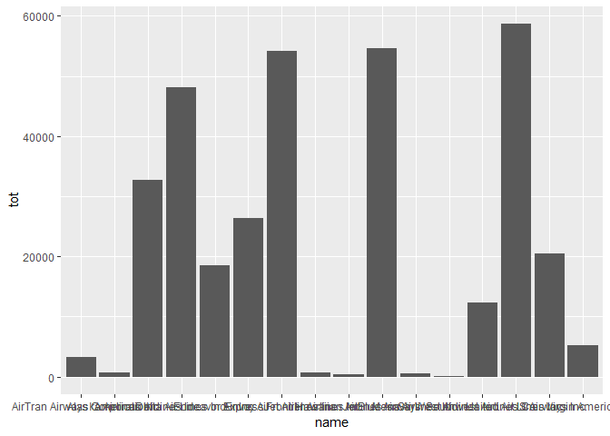
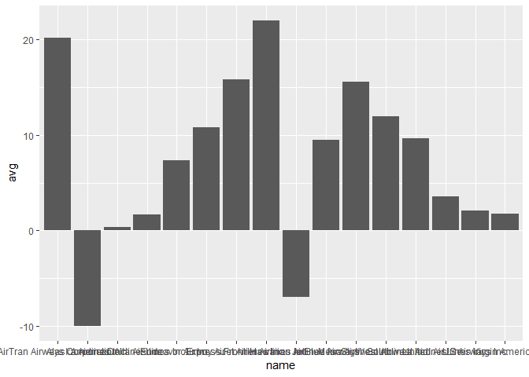

lesson 7: Data manipulation
================

Data analysis
=============

`dplyr` is a package within the `tidyverse` designed for data manipulation: transforming, selecting, grouping and summarizing variables. The philosphy of `dplyr` is to offer a more intuitive syntax than base R. Also, it makes easy to translate R/dplyr code into SQL queries, which means we can use dplyr to query remote sources such as a MySQL database.

The pipe operator
-----------------

To use the tidyverse more efficiently, the `tidyverse` introduces an operator that is not originally available in base R, but allows to *chain* functions together, rather than *nesting* them. This operator `%>%` is called the pipe. What the `%>%` does, is to pass the value that preceeds `%>%` to the first position of the subsequent function (or alternatively anywhere you place a `.`). For instance:

``` r
round(mean(c(1:10, NA), na.rm = T), 0)
```

    ## [1] 6

Can be written as

``` r
c(1:10, NA) %>% 
  mean(na.rm = T) %>% 
  round(0)
```

    ## [1] 6

Which is equivalent to

``` r
c(1:10, NA) %>% 
  mean(x = . , na.rm = T) %>% #the dot is just a pronoun for what precedes the pipe operator
  round(x = ., digits = 0)
```

dplyr verbs
-----------

dplyr has seven fundamental verbs for data manipulation.

To manipulate rows:

-   `filter()`: select rows
-   `distinct()`: select unique set of rows
-   `arrange()`: sort rows

To manipulate columns:

-   `select()`: select/drop columns
-   `mutate()`: add columns

To group:

-   `group_by()`: group by a variable(s)
-   `count()`: sum grouping by a variable(s)
-   `summarise()`: run a function producing 1 output for each grouping level

To manipulate dataframes:

-   `*_join()`: merge multiple dataframe together

Manipulating rows
-----------------

### Filter

`filter()` retrieves all rows that evaluate to `TRUE`:

``` r
#to retain all Spanish males:
selfiesCasualties %>% 
  filter(country == 'Spain' & gender == 'Male')
```

    ## Warning: package 'bindrcpp' was built under R version 3.4.4

    ##         class country gender age nationality  month year
    ## 1 Electricity   Spain   Male  21       Spain  March 2014
    ## 2      Animal   Spain   Male  32       Spain August 2015

``` r
#to retain only casualties in 2014 and 2015
selfiesCasualties %>% 
  filter(between(year, 2014, 2015))
```

    ##          class      country gender     age  nationality     month year
    ## 1  Electricity        Spain   Male      21        Spain     March 2014
    ## 2       Height       Russia Female      17       Russia     April 2014
    ## 3     Vehicles          USA Female      32          USA     April 2014
    ## 4     Vehicles          USA   Male      29          USA       May 2014
    ## 5        Train        India   Male      15        India       May 2014
    ## 6       Height        Italy Female      16        Italy      June 2014
    ## 7       Height  Philippines Female      14  Philippines      July 2014
    ## 8       Height     Portugal   Male unknown       Poland    August 2014
    ## 9  Electricity        India   Male      14        India    August 2014
    ## 10     Weapons       Mexico   Male      21       Mexico    August 2014
    ## 11    Vehicles          USA Female      54          USA    August 2014
    ## 12       Water  Philippines Female      18  Philippines   October 2014
    ## 13      Height        Spain Female      23       Poland  November 2014
    ## 14     Weapons       Russia   Male unknown       Russia   January 2015
    ## 15       Train        India   Male   20-22        India   January 2015
    ## 16 Electricity        India   Male      16        India   January 2015
    ## 17      Height South Africa Female      21 South Africa   January 2015
    ## 18       Train        India   Male      24       Israel  February 2015
    ## 19       Water        India   Male      18        India     March 2015
    ## 20       Train       Serbia   Male      22       Serbia     April 2015
    ## 21 Electricity      Romania Female      18      Romania       May 2015
    ## 22 Electricity       Russia   Male   13-19       Russia       May 2015
    ## 23      Height    Indonesia   Male      21    Indonesia       May 2015
    ## 24      Height    Indonesia   Male      21    Singapore       May 2015
    ## 25      Height       Russia Female      21       Russia      July 2015
    ## 26    Vehicles  Philippines Female      24         <NA>      July 2015
    ## 27      Animal        Spain   Male      32        Spain    August 2015
    ## 28     Weapons          USA   Male      19          USA September 2015
    ## 29      Height        India   Male unknown        Japan September 2015
    ## 30      Height        India   Male unknown        India September 2015
    ## 31      Height       Russia   Male      17       Russia September 2015
    ## 32      Height        China   Male unknown         <NA> September 2015
    ## 33      Height        India   Male      22        India   October 2015
    ## 34       Water        India   Male      42        India   October 2015
    ## 35      Height        Chile Female      68     Bulgaria   October 2015
    ## 36       Train        India   Male      18        India  November 2015
    ## 37 Electricity        India   Male      14        India  November 2015
    ## 38       Train        India   Male      18        India  December 2015
    ## 39       Train     Pakistan   Male      22     Pakistan  December 2015
    ## 40    Vehicles       Turkey   Male      17       Turkey  December 2015

1.  Using `titanicDt`, filter the count of female children who did not survive

``` r
titanicDt %>%
  filter(Age == 'Child' & Sex == "Female" & Survived == "No")
```

    ##   Class    Sex   Age Survived  n
    ## 1   1st Female Child       No  0
    ## 2   2nd Female Child       No  0
    ## 3   3rd Female Child       No 17
    ## 4  Crew Female Child       No  0

1.  Using `beerDt`, filter the records from 1903 to 1997 (use the shortcut `dplyr::between()`)

``` r
beerDt %>%
  filter(between(Year, 1903, 1997))
```

    ##    Year GallonsCapita
    ## 1  1997          1.22
    ## 2  1996          1.23
    ## 3  1995          1.23
    ## 4  1994          1.25
    ## 5  1993          1.26
    ## 6  1992          1.29
    ## 7  1991          1.29
    ## 8  1990          1.34
    ## 9  1985          1.33
    ## 10 1980          1.37
    ## 11 1975          1.25
    ## 12 1970          1.14
    ## 13 1960          0.99
    ## 14 1950          1.04
    ## 15 1940          0.73
    ## 16 1934          0.61
    ## 17 1917          1.08
    ## 18 1903          1.31

1.  Using `untidyReview`, filter all records with missing values on `reviewLocation`. Hint: you need to use `is.na()` to test what elements are missing.

``` r
untidyReview %>%
  filter(is.na(reviewLocation))
```

    ##    reviewId reviewStayYear reviewOverall reviewCleanliness reviewLocation
    ## 1 116749729           2010             3                 2             NA
    ## 2 115722120           2010             5                 5             NA
    ## 3  99545865           2010             4                NA             NA
    ## 4 116961339           2010             4                 4             NA
    ##   reviewRooms reviewService reviewValue
    ## 1          NA             2           2
    ## 2          NA             5           5
    ## 3          NA            NA          NA
    ## 4          NA             3          NA

1.  Using `selfiesCasualties`, filter all records for victims who dies abroad (`country` different than `nationality`)

``` r
selfiesCasualties %>%
  filter(country != nationality)
```

    ##    class   country gender     age nationality     month year
    ## 1 Height  Portugal   Male unknown      Poland    August 2014
    ## 2 Height     Spain Female      23      Poland  November 2014
    ## 3  Train     India   Male      24      Israel  February 2015
    ## 4 Height Indonesia   Male      21   Singapore       May 2015
    ## 5 Height     India   Male unknown       Japan September 2015
    ## 6 Height     Chile Female      68    Bulgaria   October 2015
    ## 7 Height      Peru   Male      28 South Korea      June 2016
    ## 8 Height      Peru   Male      51     Germany      June 2016

To filter positionally, use `slice()` or `filter(between(row_number(), 1, 10))`. For instance, to filter the first 3 rows from `titanicDt`

``` r
slice(titanicDt, 1:3) 
```

    ##   Class  Sex   Age Survived  n
    ## 1   1st Male Child       No  0
    ## 2   2nd Male Child       No  0
    ## 3   3rd Male Child       No 35

``` r
titanicDt %>% filter(between(row_number(), 1, 3))
```

    ##   Class  Sex   Age Survived  n
    ## 1   1st Male Child       No  0
    ## 2   2nd Male Child       No  0
    ## 3   3rd Male Child       No 35

### Distinct

`distinct` retains unique rows from the input table grouping by the variables specified. For instance, the combination of unique country-gender combinations:

``` r
selfiesCasualties %>% 
  filter(country == 'Spain' & gender == 'Male') %>% 
  distinct(country, gender)
```

    ##   country gender
    ## 1   Spain   Male

Note that `distinct` will also automatically drop all columns that are not passed into `distinct`. To keep all columns in the dataset, you need to specify `.keep_all = TRUE`.

1.  Using `selfiesCasualties`, subset the dataset by the distinct levels for `class`

``` r
selfiesCasualties %>%
  distinct(class, .keep_all = FALSE)
```

    ##         class
    ## 1 Electricity
    ## 2      Height
    ## 3    Vehicles
    ## 4       Train
    ## 5     Weapons
    ## 6       Water
    ## 7      Animal

1.  Using `titanicDt`, create a 2 columns dataset for the unique combinations of `Age` and `Sex`

``` r
titanicDt %>%
  distinct(Age, Sex)
```

    ##      Sex   Age
    ## 1   Male Child
    ## 2 Female Child
    ## 3   Male Adult
    ## 4 Female Adult

### Arrange

`arrange` sorts the rows by the grouping variables you pass to the function:

``` r
selfiesCasualties %>% 
  arrange(class)
```

    ##          class      country gender     age  nationality     month year
    ## 1       Animal        Spain   Male      32        Spain    August 2015
    ## 2       Animal        India   Male      15        India     April 2016
    ## 3       Animal        China   Male unknown        China       May 2016
    ## 4       Animal        Nepal   Male unknown        Nepal      July 2016
    ## 5  Electricity        Spain   Male      21        Spain     March 2014
    ## 6  Electricity        India   Male      14        India    August 2014
    ## 7  Electricity        India   Male      16        India   January 2015
    ## 8  Electricity      Romania Female      18      Romania       May 2015
    ## 9  Electricity       Russia   Male   13-19       Russia       May 2015
    ## 10 Electricity        India   Male      14        India  November 2015
    ## 11      Height       Russia Female      17       Russia     April 2014
    ## 12      Height        Italy Female      16        Italy      June 2014
    ## 13      Height  Philippines Female      14  Philippines      July 2014
    ## 14      Height     Portugal   Male unknown       Poland    August 2014
    ## 15      Height        Spain Female      23       Poland  November 2014
    ## 16      Height South Africa Female      21 South Africa   January 2015
    ## 17      Height    Indonesia   Male      21    Indonesia       May 2015
    ## 18      Height    Indonesia   Male      21    Singapore       May 2015
    ## 19      Height       Russia Female      21       Russia      July 2015
    ## 20      Height        India   Male unknown        Japan September 2015
    ## 21      Height        India   Male unknown        India September 2015
    ## 22      Height       Russia   Male      17       Russia September 2015
    ## 23      Height        China   Male unknown         <NA> September 2015
    ## 24      Height        India   Male      22        India   October 2015
    ## 25      Height        Chile Female      68     Bulgaria   October 2015
    ## 26      Height  Philippines Female      19  Philippines   January 2016
    ## 27      Height        India   Male      20        India   January 2016
    ## 28      Height        India Female      18        India   January 2016
    ## 29      Height        India   Male      23        India   January 2016
    ## 30      Height        India   Male      18        India  February 2016
    ## 31      Height        India   Male      24        India  February 2016
    ## 32      Height        India   Male      17        India  February 2016
    ## 33      Height    Hong Kong   Male   30-39    Hong Kong     March 2016
    ## 34      Height        India   Male      17        India     April 2016
    ## 35      Height        India   Male      25        India     April 2016
    ## 36      Height        India   Male      23        India      June 2016
    ## 37      Height        India   Male      20        India      June 2016
    ## 38      Height         Peru   Male      28  South Korea      June 2016
    ## 39      Height         Peru   Male      51      Germany      June 2016
    ## 40      Height          USA Female      37          USA      June 2016
    ## 41      Height        India   Male      36        India      July 2016
    ## 42      Height        India   Male   17-18        India    August 2016
    ## 43      Height        India Female      22        India    August 2016
    ## 44      Height        India   Male      22        India    August 2016
    ## 45      Height        India Female      27        India    August 2016
    ## 46      Height     Pakistan Female unknown     Pakistan    August 2016
    ## 47       Train        India   Male      15        India       May 2014
    ## 48       Train        India   Male   20-22        India   January 2015
    ## 49       Train        India   Male      24       Israel  February 2015
    ## 50       Train       Serbia   Male      22       Serbia     April 2015
    ## 51       Train        India   Male      18        India  November 2015
    ## 52       Train        India   Male      18        India  December 2015
    ## 53       Train     Pakistan   Male      22     Pakistan  December 2015
    ## 54       Train        India   Male      16        India   January 2016
    ## 55       Train        India   Male      18        India     April 2016
    ## 56       Train        India   Male      16        India     April 2016
    ## 57       Train        China Female      19        China     April 2016
    ## 58    Vehicles          USA Female      32          USA     April 2014
    ## 59    Vehicles          USA   Male      29          USA       May 2014
    ## 60    Vehicles          USA Female      54          USA    August 2014
    ## 61    Vehicles  Philippines Female      24         <NA>      July 2015
    ## 62    Vehicles       Turkey   Male      17       Turkey  December 2015
    ## 63       Water  Philippines Female      18  Philippines   October 2014
    ## 64       Water        India   Male      18        India     March 2015
    ## 65       Water        India   Male      42        India   October 2015
    ## 66       Water        India   Male      20        India   January 2016
    ## 67       Water        India   Male      21        India      June 2016
    ## 68       Water        India   Male      18        India      June 2016
    ## 69       Water        India   Male   15-16        India      July 2016
    ## 70       Water        India   Male      42        India      July 2016
    ## 71       Water        India   Male      19        India      July 2016
    ## 72       Water        India Female      24        India      July 2016
    ## 73       Water        India   Male      24        India      July 2016
    ## 74       Water        India Female      20        India      July 2016
    ## 75       Water        India   Male      34        India      July 2016
    ## 76       Water     Pakistan Female unknown     Pakistan    August 2016
    ## 77       Water     Pakistan Female      11     Pakistan    August 2016
    ## 78       Water        India Female      22        India September 2016
    ## 79     Weapons       Mexico   Male      21       Mexico    August 2014
    ## 80     Weapons       Russia   Male unknown       Russia   January 2015
    ## 81     Weapons          USA   Male      19          USA September 2015
    ## 82     Weapons          USA   Male      43          USA     March 2016
    ## 83     Weapons    Australia   Male      22    Australia     March 2016
    ## 84     Weapons        India   Male      15        India       May 2016
    ## 85     Weapons          USA   Male      15          USA      June 2016

1.  Using `titanicDt`, arrange by Class, Age, Sex

``` r
titanicDt %>%
  arrange(Class, Age, Sex)
```

    ##    Class    Sex   Age Survived   n
    ## 1    1st Female Adult       No   4
    ## 2    1st Female Adult      Yes 140
    ## 3    1st   Male Adult       No 118
    ## 4    1st   Male Adult      Yes  57
    ## 5    1st Female Child       No   0
    ## 6    1st Female Child      Yes   1
    ## 7    1st   Male Child       No   0
    ## 8    1st   Male Child      Yes   5
    ## 9    2nd Female Adult       No  13
    ## 10   2nd Female Adult      Yes  80
    ## 11   2nd   Male Adult       No 154
    ## 12   2nd   Male Adult      Yes  14
    ## 13   2nd Female Child       No   0
    ## 14   2nd Female Child      Yes  13
    ## 15   2nd   Male Child       No   0
    ## 16   2nd   Male Child      Yes  11
    ## 17   3rd Female Adult       No  89
    ## 18   3rd Female Adult      Yes  76
    ## 19   3rd   Male Adult       No 387
    ## 20   3rd   Male Adult      Yes  75
    ## 21   3rd Female Child       No  17
    ## 22   3rd Female Child      Yes  14
    ## 23   3rd   Male Child       No  35
    ## 24   3rd   Male Child      Yes  13
    ## 25  Crew Female Adult       No   3
    ## 26  Crew Female Adult      Yes  20
    ## 27  Crew   Male Adult       No 670
    ## 28  Crew   Male Adult      Yes 192
    ## 29  Crew Female Child       No   0
    ## 30  Crew Female Child      Yes   0
    ## 31  Crew   Male Child       No   0
    ## 32  Crew   Male Child      Yes   0

1.  Using `titanicDt`, arrange descending by `n`

``` r
titanicDt %>%
  arrange(desc(n))
```

    ##    Class    Sex   Age Survived   n
    ## 1   Crew   Male Adult       No 670
    ## 2    3rd   Male Adult       No 387
    ## 3   Crew   Male Adult      Yes 192
    ## 4    2nd   Male Adult       No 154
    ## 5    1st Female Adult      Yes 140
    ## 6    1st   Male Adult       No 118
    ## 7    3rd Female Adult       No  89
    ## 8    2nd Female Adult      Yes  80
    ## 9    3rd Female Adult      Yes  76
    ## 10   3rd   Male Adult      Yes  75
    ## 11   1st   Male Adult      Yes  57
    ## 12   3rd   Male Child       No  35
    ## 13  Crew Female Adult      Yes  20
    ## 14   3rd Female Child       No  17
    ## 15   3rd Female Child      Yes  14
    ## 16   2nd   Male Adult      Yes  14
    ## 17   2nd Female Adult       No  13
    ## 18   3rd   Male Child      Yes  13
    ## 19   2nd Female Child      Yes  13
    ## 20   2nd   Male Child      Yes  11
    ## 21   1st   Male Child      Yes   5
    ## 22   1st Female Adult       No   4
    ## 23  Crew Female Adult       No   3
    ## 24   1st Female Child      Yes   1
    ## 25   1st   Male Child       No   0
    ## 26   2nd   Male Child       No   0
    ## 27  Crew   Male Child       No   0
    ## 28   1st Female Child       No   0
    ## 29   2nd Female Child       No   0
    ## 30  Crew Female Child       No   0
    ## 31  Crew   Male Child      Yes   0
    ## 32  Crew Female Child      Yes   0

Manipulate Columns
------------------

### Select and mutate

`select` keeps only the variables you pass (or it drops them if you use `-`). For example to select only `class` and `country`:

``` r
selfiesCasualties %>% 
  select(class, country)
```

    ##          class      country
    ## 1  Electricity        Spain
    ## 2       Height       Russia
    ## 3     Vehicles          USA
    ## 4     Vehicles          USA
    ## 5        Train        India
    ## 6       Height        Italy
    ## 7       Height  Philippines
    ## 8       Height     Portugal
    ## 9  Electricity        India
    ## 10     Weapons       Mexico
    ## 11    Vehicles          USA
    ## 12       Water  Philippines
    ## 13      Height        Spain
    ## 14     Weapons       Russia
    ## 15       Train        India
    ## 16 Electricity        India
    ## 17      Height South Africa
    ## 18       Train        India
    ## 19       Water        India
    ## 20       Train       Serbia
    ## 21 Electricity      Romania
    ## 22 Electricity       Russia
    ## 23      Height    Indonesia
    ## 24      Height    Indonesia
    ## 25      Height       Russia
    ## 26    Vehicles  Philippines
    ## 27      Animal        Spain
    ## 28     Weapons          USA
    ## 29      Height        India
    ## 30      Height        India
    ## 31      Height       Russia
    ## 32      Height        China
    ## 33      Height        India
    ## 34       Water        India
    ## 35      Height        Chile
    ## 36       Train        India
    ## 37 Electricity        India
    ## 38       Train        India
    ## 39       Train     Pakistan
    ## 40    Vehicles       Turkey
    ## 41      Height  Philippines
    ## 42      Height        India
    ## 43      Height        India
    ## 44      Height        India
    ## 45       Train        India
    ## 46       Water        India
    ## 47      Height        India
    ## 48      Height        India
    ## 49      Height        India
    ## 50     Weapons          USA
    ## 51     Weapons    Australia
    ## 52      Height    Hong Kong
    ## 53      Height        India
    ## 54       Train        India
    ## 55      Height        India
    ## 56       Train        India
    ## 57      Animal        India
    ## 58       Train        China
    ## 59     Weapons        India
    ## 60      Animal        China
    ## 61     Weapons          USA
    ## 62      Height        India
    ## 63       Water        India
    ## 64      Height        India
    ## 65      Height         Peru
    ## 66      Height         Peru
    ## 67      Height          USA
    ## 68       Water        India
    ## 69       Water        India
    ## 70      Height        India
    ## 71       Water        India
    ## 72       Water        India
    ## 73       Water        India
    ## 74       Water        India
    ## 75       Water        India
    ## 76       Water        India
    ## 77      Animal        Nepal
    ## 78       Water     Pakistan
    ## 79       Water     Pakistan
    ## 80      Height        India
    ## 81      Height        India
    ## 82      Height        India
    ## 83      Height        India
    ## 84      Height     Pakistan
    ## 85       Water        India

To select multiple columns, you can use `class:age` (from variable class to variable gender), or any from the `?select_helpers`.

1.  Using `sn_revenue`, select only variables for company names and year 2015.

``` r
sn_revenue %>%
  select(company, y2015)
```

    ##    company    y2015
    ## 1 Facebook 17928.00
    ## 2 LinkedIn  2991.00
    ## 3  Twitter  2218.03
    ## 4     Yelp   549.71

1.  Using `untidyReview`, select only the variables containing review ratings.

``` r
untidyReview %>%
  select(-reviewId, -reviewStayYear)
```

    ##    reviewOverall reviewCleanliness reviewLocation reviewRooms
    ## 1              5                 4              4           5
    ## 2              4                 5              2           5
    ## 3              4                 5              5           5
    ## 4              4                 5              4           4
    ## 5              3                 2             NA          NA
    ## 6              5                 5             NA          NA
    ## 7              4                 5              5           4
    ## 8              5                 5              5           5
    ## 9              3                 3              5           2
    ## 10             4                 5              5           4
    ## 11             5                 5              5           5
    ## 12             4                 4              5           4
    ## 13             2                 4              4           3
    ## 14             5                 5              5           3
    ## 15             5                 5              5           5
    ## 16             3                 4              4           2
    ## 17             4                NA             NA          NA
    ## 18             5                 5              5           5
    ## 19             4                 5              5           5
    ## 20             4                 4             NA          NA
    ##    reviewService reviewValue
    ## 1              5           4
    ## 2              5           3
    ## 3              5           5
    ## 4              4           4
    ## 5              2           2
    ## 6              5           5
    ## 7              5           4
    ## 8              5           5
    ## 9              3           4
    ## 10             3           4
    ## 11             3           4
    ## 12             3           5
    ## 13             1           2
    ## 14             4           4
    ## 15             5           5
    ## 16             3           4
    ## 17            NA          NA
    ## 18             5           5
    ## 19             5           5
    ## 20             3          NA

`mutate()` instead adds a new variable. For example, we can add the birthdate of the victims by subtracting their age from the year of the accident:

``` r
selfiesCasualties %>% 
  mutate(birthDate = year - as.numeric(age))
```

    ## Warning in evalq(year - as.numeric(age), <environment>): NAs introduced by
    ## coercion

    ##          class      country gender     age  nationality     month year
    ## 1  Electricity        Spain   Male      21        Spain     March 2014
    ## 2       Height       Russia Female      17       Russia     April 2014
    ## 3     Vehicles          USA Female      32          USA     April 2014
    ## 4     Vehicles          USA   Male      29          USA       May 2014
    ## 5        Train        India   Male      15        India       May 2014
    ## 6       Height        Italy Female      16        Italy      June 2014
    ## 7       Height  Philippines Female      14  Philippines      July 2014
    ## 8       Height     Portugal   Male unknown       Poland    August 2014
    ## 9  Electricity        India   Male      14        India    August 2014
    ## 10     Weapons       Mexico   Male      21       Mexico    August 2014
    ## 11    Vehicles          USA Female      54          USA    August 2014
    ## 12       Water  Philippines Female      18  Philippines   October 2014
    ## 13      Height        Spain Female      23       Poland  November 2014
    ## 14     Weapons       Russia   Male unknown       Russia   January 2015
    ## 15       Train        India   Male   20-22        India   January 2015
    ## 16 Electricity        India   Male      16        India   January 2015
    ## 17      Height South Africa Female      21 South Africa   January 2015
    ## 18       Train        India   Male      24       Israel  February 2015
    ## 19       Water        India   Male      18        India     March 2015
    ## 20       Train       Serbia   Male      22       Serbia     April 2015
    ## 21 Electricity      Romania Female      18      Romania       May 2015
    ## 22 Electricity       Russia   Male   13-19       Russia       May 2015
    ## 23      Height    Indonesia   Male      21    Indonesia       May 2015
    ## 24      Height    Indonesia   Male      21    Singapore       May 2015
    ## 25      Height       Russia Female      21       Russia      July 2015
    ## 26    Vehicles  Philippines Female      24         <NA>      July 2015
    ## 27      Animal        Spain   Male      32        Spain    August 2015
    ## 28     Weapons          USA   Male      19          USA September 2015
    ## 29      Height        India   Male unknown        Japan September 2015
    ## 30      Height        India   Male unknown        India September 2015
    ## 31      Height       Russia   Male      17       Russia September 2015
    ## 32      Height        China   Male unknown         <NA> September 2015
    ## 33      Height        India   Male      22        India   October 2015
    ## 34       Water        India   Male      42        India   October 2015
    ## 35      Height        Chile Female      68     Bulgaria   October 2015
    ## 36       Train        India   Male      18        India  November 2015
    ## 37 Electricity        India   Male      14        India  November 2015
    ## 38       Train        India   Male      18        India  December 2015
    ## 39       Train     Pakistan   Male      22     Pakistan  December 2015
    ## 40    Vehicles       Turkey   Male      17       Turkey  December 2015
    ## 41      Height  Philippines Female      19  Philippines   January 2016
    ## 42      Height        India   Male      20        India   January 2016
    ## 43      Height        India Female      18        India   January 2016
    ## 44      Height        India   Male      23        India   January 2016
    ## 45       Train        India   Male      16        India   January 2016
    ## 46       Water        India   Male      20        India   January 2016
    ## 47      Height        India   Male      18        India  February 2016
    ## 48      Height        India   Male      24        India  February 2016
    ## 49      Height        India   Male      17        India  February 2016
    ## 50     Weapons          USA   Male      43          USA     March 2016
    ## 51     Weapons    Australia   Male      22    Australia     March 2016
    ## 52      Height    Hong Kong   Male   30-39    Hong Kong     March 2016
    ## 53      Height        India   Male      17        India     April 2016
    ## 54       Train        India   Male      18        India     April 2016
    ## 55      Height        India   Male      25        India     April 2016
    ## 56       Train        India   Male      16        India     April 2016
    ## 57      Animal        India   Male      15        India     April 2016
    ## 58       Train        China Female      19        China     April 2016
    ## 59     Weapons        India   Male      15        India       May 2016
    ## 60      Animal        China   Male unknown        China       May 2016
    ## 61     Weapons          USA   Male      15          USA      June 2016
    ## 62      Height        India   Male      23        India      June 2016
    ## 63       Water        India   Male      21        India      June 2016
    ## 64      Height        India   Male      20        India      June 2016
    ## 65      Height         Peru   Male      28  South Korea      June 2016
    ## 66      Height         Peru   Male      51      Germany      June 2016
    ## 67      Height          USA Female      37          USA      June 2016
    ## 68       Water        India   Male      18        India      June 2016
    ## 69       Water        India   Male   15-16        India      July 2016
    ## 70      Height        India   Male      36        India      July 2016
    ## 71       Water        India   Male      42        India      July 2016
    ## 72       Water        India   Male      19        India      July 2016
    ## 73       Water        India Female      24        India      July 2016
    ## 74       Water        India   Male      24        India      July 2016
    ## 75       Water        India Female      20        India      July 2016
    ## 76       Water        India   Male      34        India      July 2016
    ## 77      Animal        Nepal   Male unknown        Nepal      July 2016
    ## 78       Water     Pakistan Female unknown     Pakistan    August 2016
    ## 79       Water     Pakistan Female      11     Pakistan    August 2016
    ## 80      Height        India   Male   17-18        India    August 2016
    ## 81      Height        India Female      22        India    August 2016
    ## 82      Height        India   Male      22        India    August 2016
    ## 83      Height        India Female      27        India    August 2016
    ## 84      Height     Pakistan Female unknown     Pakistan    August 2016
    ## 85       Water        India Female      22        India September 2016
    ##    birthDate
    ## 1       1993
    ## 2       1997
    ## 3       1982
    ## 4       1985
    ## 5       1999
    ## 6       1998
    ## 7       2000
    ## 8         NA
    ## 9       2000
    ## 10      1993
    ## 11      1960
    ## 12      1996
    ## 13      1991
    ## 14        NA
    ## 15        NA
    ## 16      1999
    ## 17      1994
    ## 18      1991
    ## 19      1997
    ## 20      1993
    ## 21      1997
    ## 22        NA
    ## 23      1994
    ## 24      1994
    ## 25      1994
    ## 26      1991
    ## 27      1983
    ## 28      1996
    ## 29        NA
    ## 30        NA
    ## 31      1998
    ## 32        NA
    ## 33      1993
    ## 34      1973
    ## 35      1947
    ## 36      1997
    ## 37      2001
    ## 38      1997
    ## 39      1993
    ## 40      1998
    ## 41      1997
    ## 42      1996
    ## 43      1998
    ## 44      1993
    ## 45      2000
    ## 46      1996
    ## 47      1998
    ## 48      1992
    ## 49      1999
    ## 50      1973
    ## 51      1994
    ## 52        NA
    ## 53      1999
    ## 54      1998
    ## 55      1991
    ## 56      2000
    ## 57      2001
    ## 58      1997
    ## 59      2001
    ## 60        NA
    ## 61      2001
    ## 62      1993
    ## 63      1995
    ## 64      1996
    ## 65      1988
    ## 66      1965
    ## 67      1979
    ## 68      1998
    ## 69        NA
    ## 70      1980
    ## 71      1974
    ## 72      1997
    ## 73      1992
    ## 74      1992
    ## 75      1996
    ## 76      1982
    ## 77        NA
    ## 78        NA
    ## 79      2005
    ## 80        NA
    ## 81      1994
    ## 82      1994
    ## 83      1989
    ## 84        NA
    ## 85      1994

1.  Using `beerDt`, convert the consumption from gallons per capita to liters (1 gallon 3.78 liters)

``` r
beerDt %>%
  mutate(liters = 3.78 * GallonsCapita)
```

    ##    Year GallonsCapita liters
    ## 1  2015          1.09 4.1202
    ## 2  2014          1.09 4.1202
    ## 3  2013          1.12 4.2336
    ## 4  2012          1.13 4.2714
    ## 5  2011          1.12 4.2336
    ## 6  2010          1.14 4.3092
    ## 7  2009          1.17 4.4226
    ## 8  2008          1.20 4.5360
    ## 9  2007          1.21 4.5738
    ## 10 2006          1.20 4.5360
    ## 11 2005          1.19 4.4982
    ## 12 2004          1.21 4.5738
    ## 13 2003          1.21 4.5738
    ## 14 2002          1.23 4.6494
    ## 15 2001          1.23 4.6494
    ## 16 2000          1.22 4.6116
    ## 17 1999          1.23 4.6494
    ## 18 1998          1.22 4.6116
    ## 19 1997          1.22 4.6116
    ## 20 1996          1.23 4.6494
    ## 21 1995          1.23 4.6494
    ## 22 1994          1.25 4.7250
    ## 23 1993          1.26 4.7628
    ## 24 1992          1.29 4.8762
    ## 25 1991          1.29 4.8762
    ## 26 1990          1.34 5.0652
    ## 27 1985          1.33 5.0274
    ## 28 1980          1.37 5.1786
    ## 29 1975          1.25 4.7250
    ## 30 1970          1.14 4.3092
    ## 31 1960          0.99 3.7422
    ## 32 1950          1.04 3.9312
    ## 33 1940          0.73 2.7594
    ## 34 1934          0.61 2.3058
    ## 35 1917          1.08 4.0824
    ## 36 1903          1.31 4.9518
    ## 37 1870          0.44 1.6632
    ## 38 1850          0.14 0.5292

1.  Using `socialNetwork_users` add a percent sign to the variable percent (use `paste0()`)

``` r
socialNetwork_users = socialNetwork_users %>%
  mutate(percent = paste0(percent, '%'))
```

1.  Using `untidyReview`, turn `reviewStayYear` into a integer

``` r
untidyReview %>%
  mutate(reviewStayYear = as.integer(reviewStayYear))
```

    ##     reviewId reviewStayYear reviewOverall reviewCleanliness reviewLocation
    ## 1   92790314           2010             5                 4              4
    ## 2   94537188           2010             4                 5              2
    ## 3  121238987           2010             4                 5              5
    ## 4   93691038           2010             4                 5              4
    ## 5  116749729           2010             3                 2             NA
    ## 6  115722120           2010             5                 5             NA
    ## 7  103370878           2010             4                 5              5
    ## 8  108045877           2010             5                 5              5
    ## 9  118813162           2010             3                 3              5
    ## 10 103751485           2010             4                 5              5
    ## 11  95492062           2010             5                 5              5
    ## 12  98772060           2010             4                 4              5
    ## 13  95230836           2010             2                 4              4
    ## 14 101015957           2010             5                 5              5
    ## 15  95240894           2010             5                 5              5
    ## 16  99731020           2010             3                 4              4
    ## 17  99545865           2010             4                NA             NA
    ## 18  91315370           2010             5                 5              5
    ## 19  94556779           2010             4                 5              5
    ## 20 116961339           2010             4                 4             NA
    ##    reviewRooms reviewService reviewValue
    ## 1            5             5           4
    ## 2            5             5           3
    ## 3            5             5           5
    ## 4            4             4           4
    ## 5           NA             2           2
    ## 6           NA             5           5
    ## 7            4             5           4
    ## 8            5             5           5
    ## 9            2             3           4
    ## 10           4             3           4
    ## 11           5             3           4
    ## 12           4             3           5
    ## 13           3             1           2
    ## 14           3             4           4
    ## 15           5             5           5
    ## 16           2             3           4
    ## 17          NA            NA          NA
    ## 18           5             5           5
    ## 19           5             5           5
    ## 20          NA             3          NA

### Grouping

`group_by` converts your tibble into subgroups depending on the grouping variable(s). It is usually used to group data before summarising with `summarise`. For instance, to count the number of female and male victims by country:

``` r
selfiesCasualties %>% 
  group_by(country, gender) %>% 
  summarise(tot = n())
```

1.  Using `titanicDt`, calculate the average casualties by class (note that the dataset has both survivors/non-survivors counts)

``` r
titanicDt %>%
  filter(Survived == "No") %>%
  group_by(Class) %>%
  summarise(avg = mean(n))
```

    ## # A tibble: 4 x 2
    ##   Class   avg
    ##   <chr> <dbl>
    ## 1 1st    30.5
    ## 2 2nd    41.8
    ## 3 3rd   132  
    ## 4 Crew  168.

1.  Using `titanicDt`, calculate the average casualties by gender (note that the dataset has both survivors/non-survivors counts)

``` r
titanicDt %>%
  filter(Survived == 'No') %>%
  group_by(Sex) %>%
  summarise(avg = mean(n))
```

    ## # A tibble: 2 x 2
    ##   Sex      avg
    ##   <chr>  <dbl>
    ## 1 Female  15.8
    ## 2 Male   170.

1.  Using `beerDt`, calculate the average consumption before and after your birthyear (hint: you may create a new variable)

``` r
beerDt <- beerDt[!(beerDt$Year %in% c(1992)),]
beerDt$preMBY <- beerDt$Year < 1992
beerDt %>%
  group_by(preMBY) %>%
  summarise(preAVG = mean(GallonsCapita))
```

    ## # A tibble: 2 x 2
    ##   preMBY preAVG
    ##   <lgl>   <dbl>
    ## 1 FALSE    1.19
    ## 2 TRUE     1.00

1.  Using `titanicDt`, calulcate the count of casualties by age, then arrange descending.

``` r
titanicDt %>%
  filter(Survived == 'No') %>%
  group_by(Age) %>%
  summarise(tot = sum(n)) %>%
  arrange(desc(tot))
```

    ## # A tibble: 2 x 2
    ##   Age     tot
    ##   <chr> <dbl>
    ## 1 Adult  1438
    ## 2 Child    52

`n()` is the count operator in dplyr (it works only within a `summarise()`, `mutate()` or `filter()`), and counts the rows by group level without taking any argument. Note that every time you use `summarise()`, your tibble drops one grouping level. For instance in the latter example, data are still grouped by country, and any further dplyr verb would apply groupwise unless we `ungroup()` first.

Because counting observations is a very common task, dplyr offers the wrapper `count`, which is equivalent to `group_by %>% summarise( n() )` except that it `ungroup()` after.

``` r
selfiesCasualties %>% 
  count(country, gender)
```

    ## # A tibble: 26 x 3
    ##    country   gender     n
    ##    <chr>     <fct>  <int>
    ##  1 Australia Male       1
    ##  2 Chile     Female     1
    ##  3 China     Female     1
    ##  4 China     Male       2
    ##  5 Hong Kong Male       1
    ##  6 India     Female     6
    ##  7 India     Male      38
    ##  8 Indonesia Male       2
    ##  9 Italy     Female     1
    ## 10 Mexico    Male       1
    ## # ... with 16 more rows

Exercise: Use `selfiesCasualties` to calculate the percent of casualties by class. One way, is to combine `groub_by()`, `sum()` and `n()`. Make sure you understand the difference between `sum()` and `n()` and how they behave when grouping.

Manipulating dataframes
-----------------------

Sometimes you need to combine different datasets into one. To join different dataset, you need at least one variable showing what is the relationship between the datasets and how to join them. For instance, consider the case where you have two separates dataset about the count of twitter and FB users during the same years (Source: eMarketer):

``` r
twitter_users
```

    ##   Year millions
    ## 1 2015     52.5
    ## 2 2016     56.8
    ## 3 2017     60.9
    ## 4 2018     64.9
    ## 5 2019     67.9
    ## 6 2020     70.7

``` r
fbMobile_users
```

    ##   Year millions
    ## 1 2015    132.9
    ## 2 2016    143.5
    ## 3 2017    150.8
    ## 4 2018    158.0
    ## 5 2019    163.0
    ## 6 2020    167.4

You want to create a single dataset containing the records for both. You can use `full_join` to bind together facebook and twitter users by year:

``` r
twitter_users %>% 
  full_join(fbMobile_users, by = c('Year' = 'Year'), suffix  = c('twitter', 'fb'))
```

    ##   Year millionstwitter millionsfb
    ## 1 2015            52.5      132.9
    ## 2 2016            56.8      143.5
    ## 3 2017            60.9      150.8
    ## 4 2018            64.9      158.0
    ## 5 2019            67.9      163.0
    ## 6 2020            70.7      167.4

``` r
#also inner_join(fbMobile_users, by = 'Year', suffix  = c('twitter', 'fb'))
```

Note that if you do not pass a character vector of variables to join, `*_join` uses all the variables with common names across the two tables.

The last example is simple because both datasets have the same number of rows and values, does `full_join`, `left_join`, or `right_join` gives the same result. However, say we add one extra value for `fbMobile_users` and `twitter_users`. In the following example instead we need to consider which join is the most appropriate since `fbMobile_users`:

``` r
fbMobile_users <- fbMobile_users %>% 
  add_row(Year = 2014, millions = 122) %>% arrange(Year)

twitter_users <- twitter_users %>% 
  add_row(Year = 2021, millions = 74.6) %>% arrange(Year)
```

By default, `full_join` creates an `NA` for the missing observation in `fbMobile_users` for 2021:

``` r
fbMobile_users %>% 
  full_join(twitter_users, by = 'Year', suffix  = c('twitter', 'fb'))
```

    ##   Year millionstwitter millionsfb
    ## 1 2014           122.0         NA
    ## 2 2015           132.9       52.5
    ## 3 2016           143.5       56.8
    ## 4 2017           150.8       60.9
    ## 5 2018           158.0       64.9
    ## 6 2019           163.0       67.9
    ## 7 2020           167.4       70.7
    ## 8 2021              NA       74.6

To keep only the years for those which appear in both datasets:

``` r
fbMobile_users %>% 
  inner_join(twitter_users, by = 'Year', suffix  = c('twitter', 'fb'))
```

    ##   Year millionstwitter millionsfb
    ## 1 2015           132.9       52.5
    ## 2 2016           143.5       56.8
    ## 3 2017           150.8       60.9
    ## 4 2018           158.0       64.9
    ## 5 2019           163.0       67.9
    ## 6 2020           167.4       70.7

Morover:

``` r
#use ?left_join() ... to view the documentation
left_join(twitter_users, fbMobile_users, by = 'Year') #retain all records from A, add those from B that match ()
```

    ##   Year millions.x millions.y
    ## 1 2015       52.5      132.9
    ## 2 2016       56.8      143.5
    ## 3 2017       60.9      150.8
    ## 4 2018       64.9      158.0
    ## 5 2019       67.9      163.0
    ## 6 2020       70.7      167.4
    ## 7 2021       74.6         NA

``` r
right_join(twitter_users, fbMobile_users, by = 'Year') #retain all records from B, add those from A that match
```

    ##   Year millions.x millions.y
    ## 1 2014         NA      122.0
    ## 2 2015       52.5      132.9
    ## 3 2016       56.8      143.5
    ## 4 2017       60.9      150.8
    ## 5 2018       64.9      158.0
    ## 6 2019       67.9      163.0
    ## 7 2020       70.7      167.4

``` r
anti_join(twitter_users, fbMobile_users, by = 'Year') #retain all records from A with not matches in B (keep just columns from A)
```

    ##   Year millions
    ## 1 2021     74.6

``` r
semi_join(twitter_users, fbMobile_users, by = 'Year') #retain all records from A with matches in B (keep just columns from A)
```

    ##   Year millions
    ## 1 2015     52.5
    ## 2 2016     56.8
    ## 3 2017     60.9
    ## 4 2018     64.9
    ## 5 2019     67.9
    ## 6 2020     70.7

Exercise
========

``` r
#we need 2 datasets from ncyflights13 package:
if (!require(nycflights13)) install.packages('nycflights13')
```

    ## Loading required package: nycflights13

    ## Warning: package 'nycflights13' was built under R version 3.4.4

``` r
flights <- flights
airlines <- airlines
#flights
#airlines
```

1.  Use the appropriate join to add the full carrier names to `flights` using `airlines` :

``` r
leftFlight <- left_join(flights, airlines, by = 'carrier')
```

1.  Count the number of flights for each carrier using the full carrier name. Then plot a bar chart of the counts.

``` r
leftFlight %>%
  group_by(name) %>%
  summarise(tot = n()) %>%
  ggplot() + 
  geom_bar(aes(x = name, y = tot), stat = 'identity')
```



1.  Calculate the average visibility for the flights by each carrier. Plot the result in a barchart.

``` r
leftFlight %>%
  group_by(name) %>%
  summarise(avg = mean(arr_delay, na.rm = T)) %>%
  ggplot() +
  geom_bar(aes(x = name, y = avg), stat = 'identity')
```



1.  What is the busiest route?

``` r
leftFlight$route <- paste(leftFlight$origin, leftFlight$dest)
leftFlight %>%  
  group_by(route) %>%
  summarise(tot = n()) %>%
  arrange(desc(tot))
```

    ## # A tibble: 224 x 2
    ##    route     tot
    ##    <chr>   <int>
    ##  1 JFK LAX 11262
    ##  2 LGA ATL 10263
    ##  3 LGA ORD  8857
    ##  4 JFK SFO  8204
    ##  5 LGA CLT  6168
    ##  6 EWR ORD  6100
    ##  7 JFK BOS  5898
    ##  8 LGA MIA  5781
    ##  9 JFK MCO  5464
    ## 10 EWR BOS  5327
    ## # ... with 214 more rows

1.  What's the busiest day for each of the departing airports?

``` r
leftFlight$date <- paste(leftFlight$month, leftFlight$day, leftFlight$year, sep = '/')
leftFlightdate <- leftFlight %>%
  group_by(origin, date) %>%
  summarise(tot = n()) %>%
  arrange(desc(tot))
```
